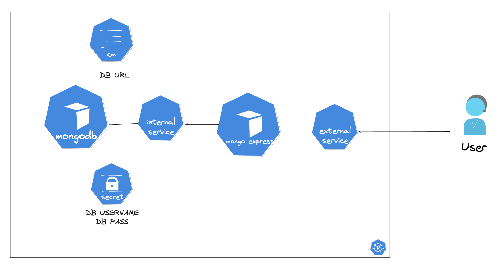

## MongoDB and Mongo-Express Kubernetes App

This project demonstrates how to deploy a MongoDB database and a Mongo-Express interface using Kubernetes on a local environment powered by Minikube. It includes resources such as Deployments, ConfigMaps, Secrets, and Services.

## Architectute

## Features

MongoDB Deployment: Persistent database storage for your application.
Mongo-Express Deployment: A web-based MongoDB admin interface.
Kubernetes Resources: Configured with ConfigMaps, Secrets, and NodePort/ClusterIP Services.
Local Development: Built for Minikube on macOS (M1 architecture).

## Prerequisites

Docker
Minikube
kubectl knowledge

## Files

| File Name                            | Description |
| ------------------------------------ | ------------- |
| mongo-depl.yaml	                     | Deployment for MongoDB.  |
| mongoexpress-depl.yaml               | Deployment for Mongo-Express.  |
| mongo-internal-service.yaml          | Internal ClusterIP Service for MongoDB.  |
| mongoexpress-external-service.yaml   | External Load Balancer Service for Mongo-Express.  |
| mongo-configmap.yaml                 | ConfigMap for MongoDB connection details.  |
| mongo-secrets.yaml                   | Secrets for MongoDB credentials. |
