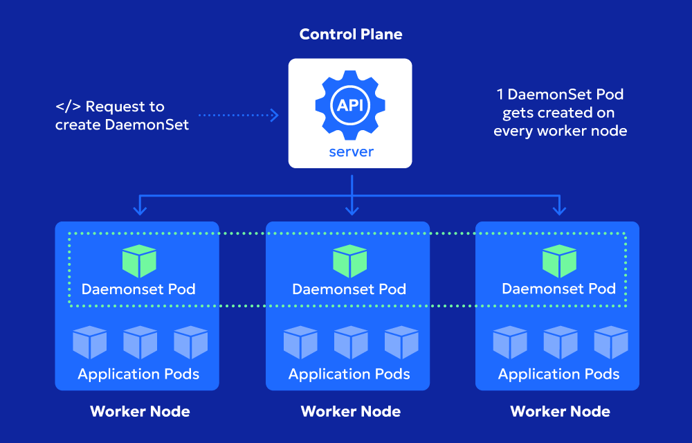

## DaemonSets

DaemonSets ensure that exactly one copy of a pod runs on every node in your Kubernetes cluster. When you add a new node, the DaemonSet automatically deploys the pod on the new node. Likewise, when a node is removed, the corresponding pod is also removed. This guarantees that a single instance of the pod is consistently available on each node.

